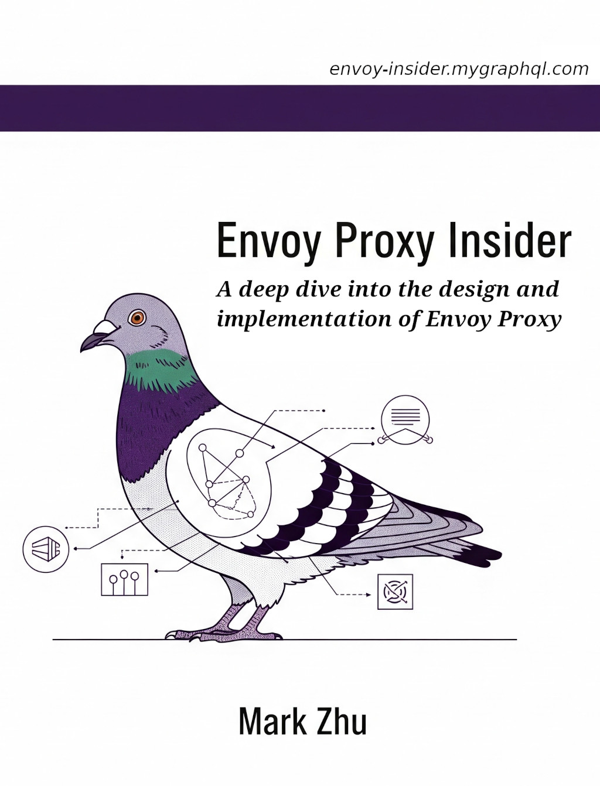

# Foreword

## Overview of this book

This book is called "Envoy Proxy Insider". It is a book in progress, now in draft stage. It’s a book that dives deep into the mechanisms and implementations of Envoy Proxy. Much of its content comes from my previous book "[Istio & Envoy Insider](https://istio-insider.mygraphql.com/en/latest/)", from which I’ve extracted the Envoy part and reorganized it into a standalone book. The purpose is to help readers focus solely on Envoy without distraction from Istio. Some content is irrelevant or inapplicable to Istio, so it makes sense to split them. Moving forward, **"Istio & Envoy Insider" will only update Istio-related content, while this new book will carry all updates related to Envoy.**

Some readers may wonder why split Envoy into a separate book. Recently, I’ve noticed that Envoy is used far beyond Istio. It has become a standalone and widely adopted programmable proxy, used across various cloud-native architectures, AI gateways, edge computing, and many non-Istio projects. It’s now infrastructure for infrastructures. That’s why I believe a dedicated book is necessary to help non-Istio readers understand its design and implementation.

### What this book is about

This book includes: Envoy source code deep dive, in-depth Envoy fundamentals  analysis. But it's not a traditional "deep dive xyz source code" type of book. on the contrary, I have done my best not to directly paste source code in the book. Reading source code is a necessary step to grasp the details of the implementation, but browsing source code in a book is generally a very bad experience. So, this book uses source code navigation diagrams to let readers understand the full picture of the implementation, rather than getting lost in the details of fragmented source code snippets and forgetting the whole picture.

In this book, I've tried to think as systematically as possible from a design and implementation perspective:
- The reasons behind the design decisions and history of evolution.
- Deep dive into the high level concept and implementation details of Envoy.


The book is just a collection of thoughts and notes after I've been researching and using Istio for a while. I've just been troubleshooting some Istio/Envoy related functionality and performance issues, and browsing and debugging some Istio/Envoy code.

While diving into Istio. I found that there is a lot of valuable information on the Internet. However, either it is mainly from the user's point of view, but does not talk about the implementation mechanism; or it does talk about the mechanism, but the content lacks systematization and consistency.

### What this book is not

This book is not a user's manual. It does not teach how to learn Envoy from a user's point of view, it does not preach how powerful Envoy is, and it does not teach how to use Envoy, there are too many excellent books, articles, and documents on this topic.

> 🤷 : [Yet, another](https://en.wikipedia.org/wiki/Yet_another) Envoy User Guide?  
> 🙅 : No!


### Target Audience

This book focuses on the design and implementation mechanism of Envoy. It is assumed that the reader already has some experience in using Envoy and is interested in further studying its implementation mechanism.

### Book access address
- [https://envoy-insider.mygraphql.com](https://envoy-insider.mygraphql.com/en)
- [https://envoy-insider.readthedocs.io](https://envoy-insider.readthedocs.io/en)
- [https://envoy-insider.rtfd.io](https://envoy-insider.rtfd.io/en)


### About the Author
My name is Mark Zhu, a balding middle-aged programmer. I’m not an Envoy expert—at most, a contributor to the Envoy Docs. Not even an employee of a tech giant.

Why do I learn from others and write a book when my level is limited? Because of this sentence:
> You don't need to be great to get started, but you do need to get started to be great.


In order to facilitate readers to follow the book's updates:
- Blog(English, RSS subscription supported): [https://blog.mygraphql.com/en/](https://blog.mygraphql.com/en/)  
- Medium: [Mark Zhu](https://mark-zhu.medium.com/)
- Blog(Chinese): [https://blog.mygraphql.com/](https://blog.mygraphql.com/)  
- WeChat public number: Mark's full of paper sugar cube words

:::{figure-md} WeChat subscription: Mark的滿紙方糖言


*WeChat: Mark的滿紙方糖言*.
:::


### Participate in writing
If you are also interested in writing this book, feel free to contact me.


#### Thanks to the fellow who suggested the Issue 🌻
- [tanjunchen](https://github.com/tanjunchen): lots of very good comments on the reading experience and typography.

### Dedication 💞
First, to my dear parents, for showing me how to live a happy
and productive life. To my dear wife and our amazing kid - thanks for all your love and patience.

### Copyleft Disclaimer
If you reproduce or modify any text or image, please give credit to the original source.

### Feedback
As this is an open source interactive book, feedback from readers is of course very important. If you find a mistake in the book, or have a better suggestion, you may want to submit an Issue:
[https://github.com/labilezhu/envoy-insider-en/issues](https://github.com/labilezhu/envoy-insider-en/issues)


## Chinese version

There is a Chinese version: [中文版](https://envoy-insider.mygraphql.com/zh-cn/latest) .




# Catalog


```{toctree}
:caption: Catalog
:maxdepth: 5
:includehidden:

ch0/index
envoy-overview.md
envoy-istio-conf-eg.md
envoy-high-level-flow/envoy-high-level-flow.md
arch/arch.md
req-resp-flow-timeline/req-resp-flow-timeline.md
connection-life/connection-life.md
envoy-istio-metrics/index.md
upstream/upstream.md
socket/socket.md
performance/performance.md
disruptions/disruptions.md
observability/observability.md
troubleshooting/troubleshooting.md
dev-envoy/dev-envoy.md
```

